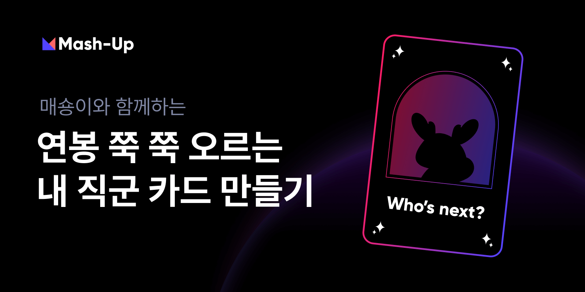

# [MSG](https://recruit-event.mash-up.kr)

MSG는 Mash-Up의 공식 캐릭터인 매숑이가 담긴 나만의 IT 직군 카드를 만드는 서비스로 MaShong Generator의 약어 입니다.
지금 MSG로 나만의 직군 카드도 만들고 Mash-Up Recruiting 기간 한정 이벤트도 참여해보세요!

## 🚀서비스 기능 소개

| 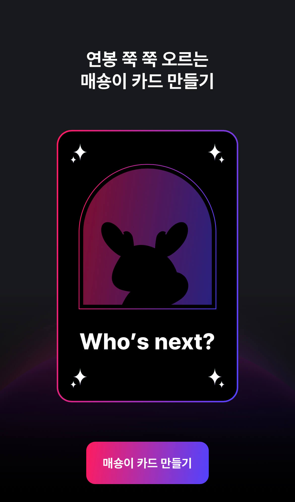 | 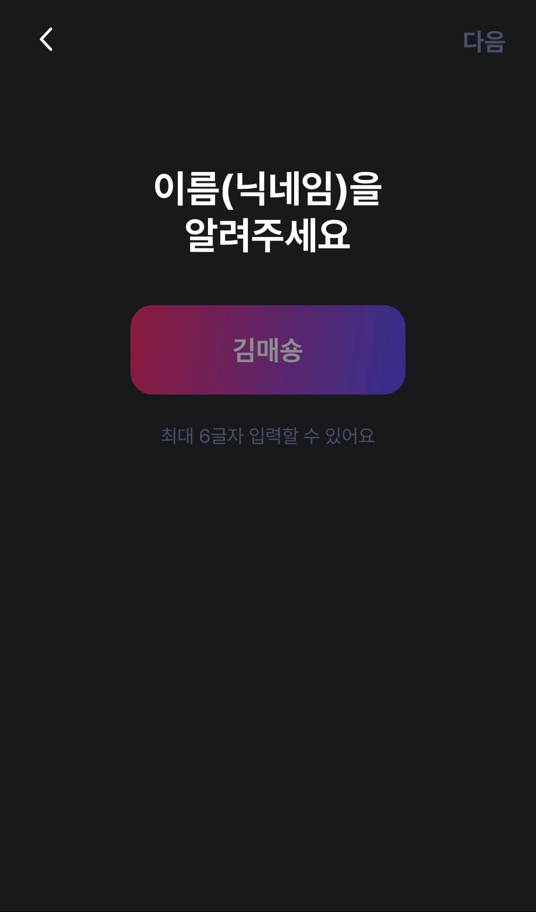         |
| ----------------------------------------------------------------- | ------------------------------------------------------------------- |
| 나만의 직군 카드 만들기                                           | 직군 카드 이름 입력                                                 |
| 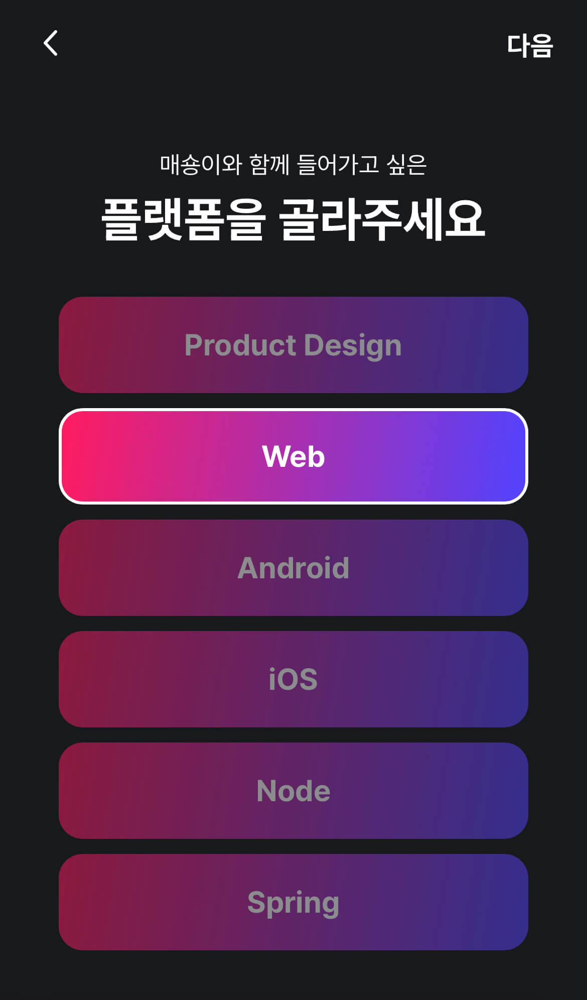   | 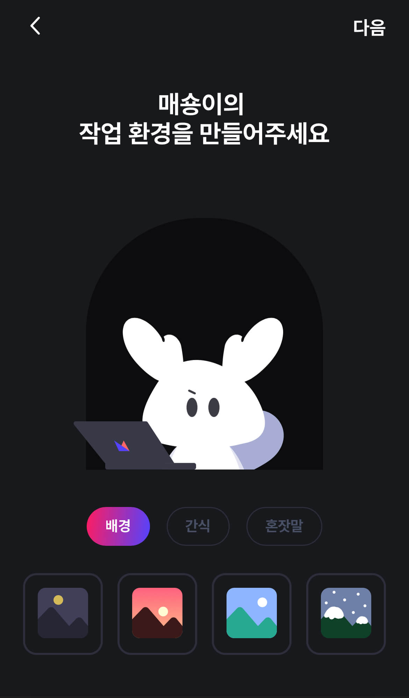   |
| 직군 선택                                                         | 직군 카드 꾸미기                                                    |
| 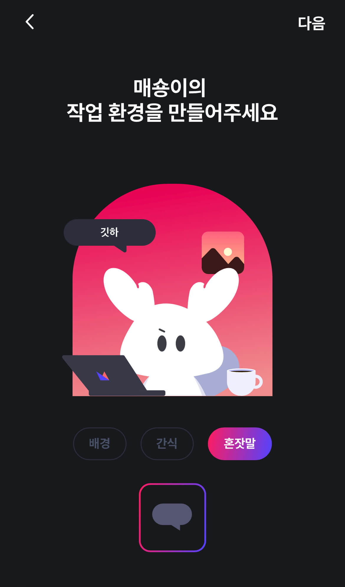 | 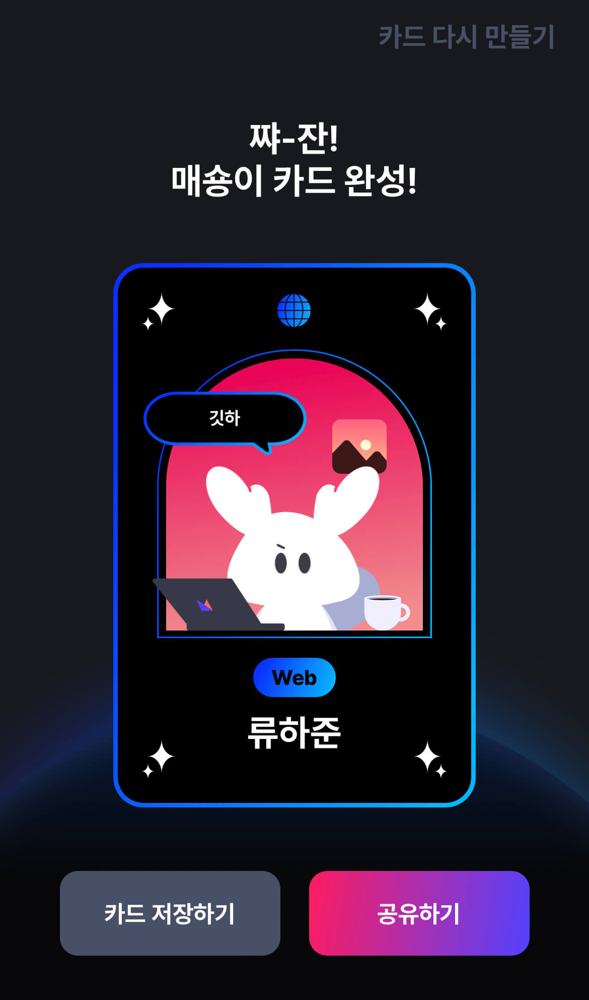       |
| 직군 카드 꾸미기                                                  | 카드 생성 결과                                                      |
| 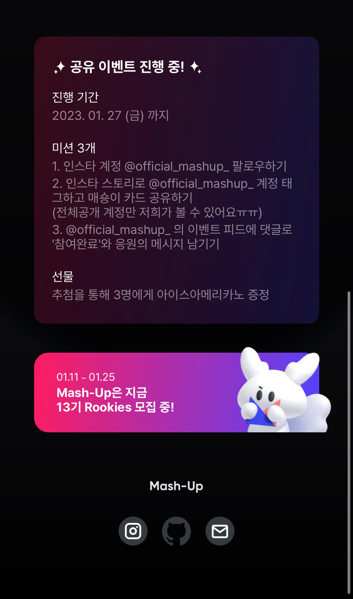      | 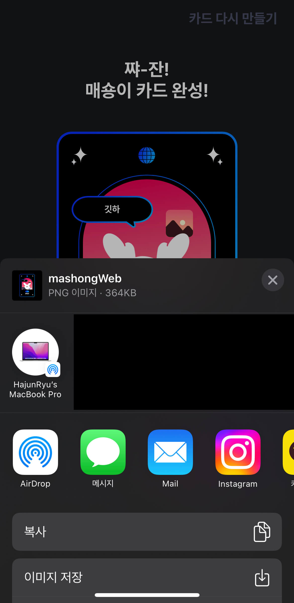         |
| 이벤트 안내                                                       | 카드 저장 및 공유하기                                               |
| 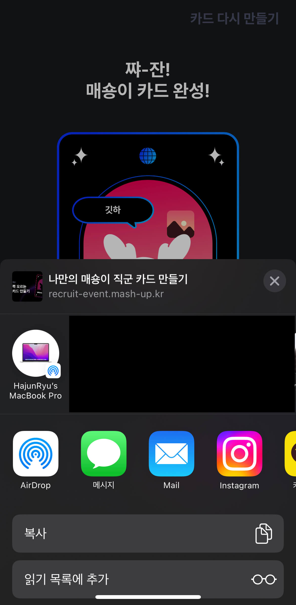      | 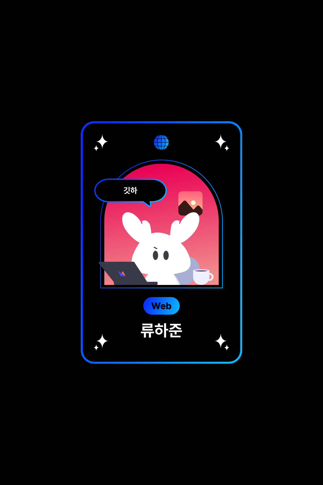 |
| 링크 공유하기                                                     | 저장된 카드 이미지                                                  |

## 🔧 사용한 기술

- 메인: Next, React, TypeScript
- 스타일: Emotion
- 모듈,번듈러: Webpack
- 패키지 매니저: Yarn
